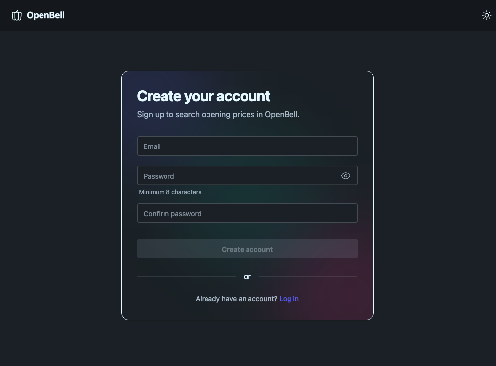
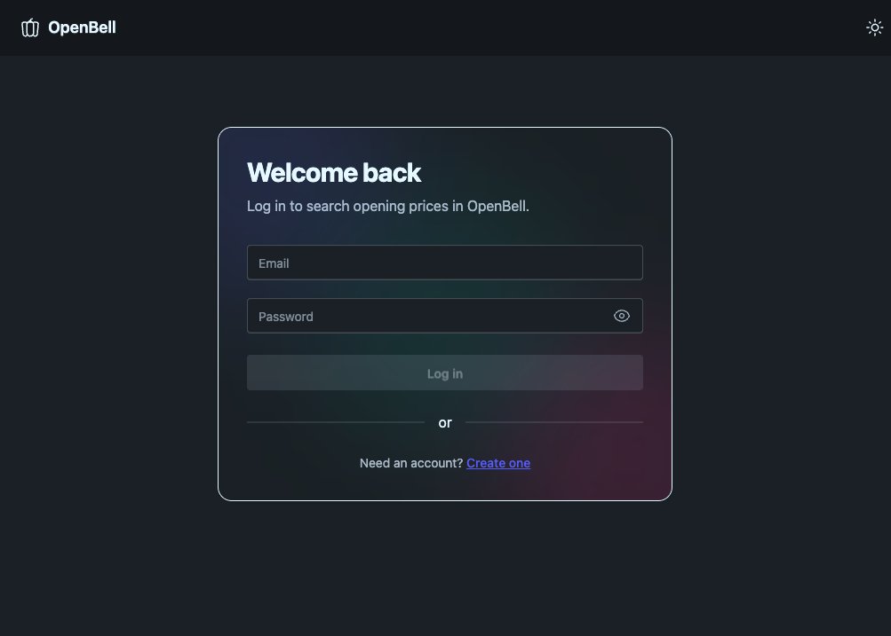
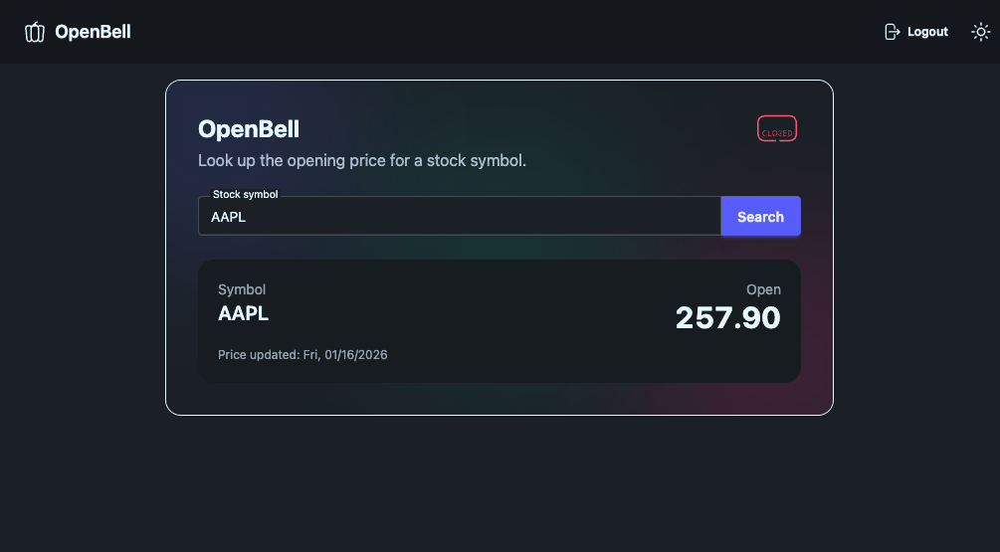

# Open Bell

## Overview

Open Bell is a full-stack web application to check the opening price of stocks. It supports:

* User signup, login, and logout
* A protected stock lookup form (available only to authenticated users)
* Fetching and displaying the **opening price** for a given stock symbol via an external API

**Live demo:** [openbell.xyz](https://openbell.xyz)

---

## Screenshots

| View | Screenshot |
|------|------------|
| Signup |  |
| Login |  |
| Open Price |  |

---

## Tech Stack

* **Framework:** Nuxt 4 (Vue 3)
* **Database:** PostgreSQL (via Prisma)
* **ORM:** Prisma
* **Auth:** Username/password with hashed passwords (bcryptjs)
* **UI:** Tailwind CSS + daisyUI + Iconify
* **Testing:** Vitest

---

## Concepts Demonstrated

* Build and deploy a complete web app
* User authentication with protected functionality
* Database persistence (users stored in Postgres)
* External API integration (stock symbol → opening price)
* Automated tests (happy path)

---

## Local Development (Postgres)

### Prerequisites

* Node.js
* pnpm (recommended) or npm
* PostgreSQL 16+

### 1) Install dependencies

This project was developed using **pnpm** (recommended for best lockfile compatibility). You can also use **npm**.

```sh
pnpm install
# or
npm install
```

> Note: `postinstall` runs `prisma generate` automatically.

### 2) Configure environment variables

Copy the example env file and update values:

```sh
cp .env.example .env
```

At minimum, set the variables documented in `.env.example`, including:

* `DATABASE_URL`
* `FINNHUB_API_KEY` (or whatever stock API key is used)

Example `DATABASE_URL`:

```env
DATABASE_URL="postgresql://YOUR_LOCAL_USER@localhost:5432/open_bell?schema=public"
```

You can usually find `YOUR_LOCAL_USER` via:

```sh
whoami
```

### 3) Start Postgres and create the database

If you already have Postgres running, skip to `createdb`.

**macOS (Homebrew):**

```sh
brew install postgresql@16
brew services start postgresql@16
```

Create the database:

```sh
createdb open_bell
psql -d open_bell -c "select 1;"
```

### 4) Apply Prisma migrations

```sh
pnpm dlx prisma migrate dev
# or
npx prisma migrate dev
```

### 5) Run the app

```sh
pnpm dev
# or
npm run dev
```

App will be available at:

* [http://localhost:3000](http://localhost:3000)

### (Optional) Prisma Studio

```sh
pnpm dlx prisma studio
# or
npx prisma studio
```

---

## Tests

Tests are written with Vitest. **Database access is mocked**, so you do **not** need Postgres running to execute the test suite.

```sh
pnpm test
# or
npm test
```

Watch mode:

```sh
pnpm test:watch
# or
npm run test:watch
```

---

## Production-like Run (Optional)

Build and start the server output:

```sh
pnpm build
pnpm start
# or
npm run build
npm run start
```

If deploying to an environment where migrations should be applied on startup/CI:

```sh
pnpm db:deploy
# or
npx prisma migrate deploy
```

---

## Troubleshooting

### Prisma can’t reach Postgres

Confirm Postgres is running:

```sh
psql -h localhost -p 5432 -d postgres -c "select 1;"
```

On macOS (Homebrew):

```sh
brew services list | grep postgres
```

### `createdb` fails due to role/user mismatch

Ensure your Postgres role exists and matches your OS username (commonly `whoami`), or update `DATABASE_URL` to use an existing role.

---

## Notes / Design Decisions

* The stock lookup feature is protected and only accessible to authenticated users.
* API calls are made server-side to avoid exposing API keys to the client.
* UI is styled with Tailwind + daisyUI for a clean, usable interface.
